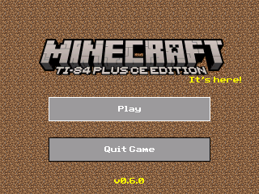
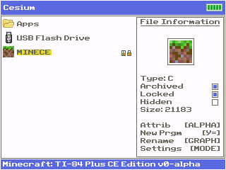
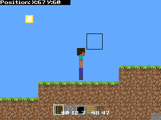
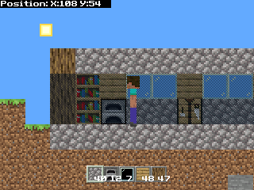
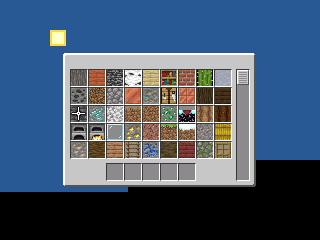

# MinecraftCE
 
 

###### Note: screenshots may be outdated
###### Oh, and also don't look too hard at how far Steve sinks into the ground
## The definitive port of Minecraft to the TI-84 Plus CE.
This project's goals:
- Working Creative Mode
- Working Survival Mode (with good combat and everything)
- New features from versions after 1.16 (i.e. Texture Update and blocks from Caves and Cliffs, Trails and Tales, etc.)
- Practical controls
- As faithful as possible to Minecraft within the limits of a graphing calculator

Not all of these goals have been achieved yet, but the majority are easily done so given the foundation I've laid so far with the existing code.
## About the Two-Layer System
If you've ever played Terraria, then this is basically it. It gives you the ability to place blocks on a background (which you can pass by) or on a foreground (which blocks you). This means that you could have a back wall to your house or be able to see the ores on the side of a cave.
## How to Play/Controls
- <kbd>2nd</kbd> - Select in menus, break blocks
- <kbd>alpha</kbd> - Build blocks (and eventually, interact with blocks)
- <kbd>mode</kbd> - Open/close inventory
- <kbd>stat</kbd> - Move cursor upwards
- <kbd>prgm</kbd> - Move cursor downwards
- arrow buttons - Move player (left/right), jump (up)
- <kbd>f1</kbd>-<kbd>f5</kbd> - Hotbar slots
